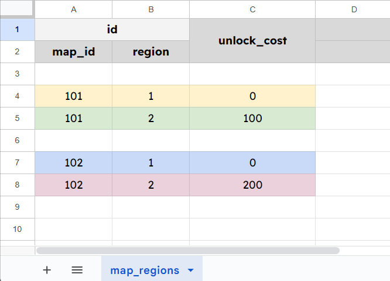

# ZBase.Foundation.Data

A code-first data management workflow for C# and Unity, powered by [BakingSheet](https://www.github.com/cathei/BakingSheet) and [Source Generators](https://docs.microsoft.com/en-us/dotnet/csharp/roslyn-sdk/source-generators-overview).

## Installation

### Requirements

- Unity 2022.3 or later

### Unity Package Manager

1. Open menu `Window` -> `Package Manager`.
2. Click the `+` button at the top-left corner, then choose `Add package from git URL...`.


3. Enter the package URL `https://github.com/Zitga-Tech/ZBase.Foundation.Data/tree/main/Packages/ZBase.Foundation.Data`.


### OpenUPM

1. Install [OpenUPM CLI](https://openupm.com/docs/getting-started.html#installing-openupm-cli).
2. Run the following command in your Unity project root directory:

```sh
openupm add com.zbase.foundation.data
```

## Usage

At high level, the workflow usually consists of the following steps:
1. **Data Authoring**: Create data sources in Google Sheets or CSV files.
2. **Data Modeling**: Design `IData` models in C# code along with the table assets to store them.
3. **Data Exporting**: Leverage **BakingSheet** to import authored data from step 1 into each corresponding table asset. This step requires a piece of bridging code and a config asset.

### Step 1. Data Authoring

For this tutorial, we will use data from this [Google Spreadsheet](https://docs.google.com/spreadsheets/d/19BtCJ6GqEE0rKCVFcfgX8-rjLdPTK8KQbE7gHonjdJ4/edit?usp=sharing).


### Step 2. Data Modeling



- Define a data model, be either `struct` or `class`, that implements the `IData` interface.
- Each field that should be mapped to a column in the data source should be decorated with `[DataProperty]`.
- In case of properties, each should be decorated with `[DataProperty]`.
- The data model should be `partial` so that source generators can generate the underlying implementation.

```csharp
using ZBase.Foundation.Data;

public partial struct MapRegionIdData : IData
{
    // The source generator for IData will write
    // the corresponding property under the hood.
    [SerializeField]
    private int _mapId;

    [DataProperty]
    private int _region;
}

public partial class MapRegionData : IData
{
    // The source generator for IData will write
    // the field and the Get_ method under the hood.
    [DataProperty]
    public MapRegionIdData Id => Get_Id();

    [DataProperty]
    public int UnlockCost => Get_UnlockCost();
}
```

As in the image above, each row represents a `MapRegionData` entry in a data table, marked by a different color.

The ID of each `MapRegionData` entry is a complex type, consists of two fields `MapId` and `Region`.

