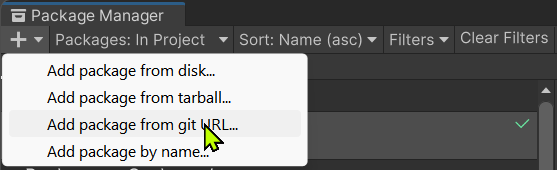
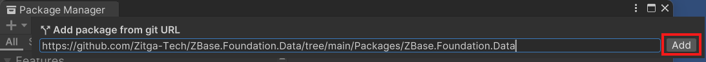
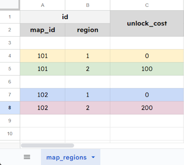

# ZBase.Foundation.Data

A code-first data management workflow for C# and Unity, powered by [BakingSheet](https://www.github.com/cathei/BakingSheet) and [Source Generators](https://docs.microsoft.com/en-us/dotnet/csharp/roslyn-sdk/source-generators-overview).

## Features

- Clear separation between runtime data models and authoring data sources.
    - Authoring code, data sources and configuration will NOT be included in the build.
- Support for Google Sheets and CSV files as data sources (powered by BakingSheet).
- Support for complex data types (with some [limitations](#limitations)).
- Automatic mapping between data sources and data models (powered by Source Generators).
- Code-first approach with minimal configuration on Unity Inspector.
- Flexible and automatic data type conversion mechanism.

## Installation

### Requirements

- Unity 2022.3 or later

### Unity Package Manager

1. Open menu `Window` -> `Package Manager`.
2. Click the `+` button at the top-left corner, then choose `Add package from git URL...`.



3. Enter the package URL `https://github.com/Zitga-Tech/ZBase.Foundation.Data/tree/main/Packages/ZBase.Foundation.Data`.



### OpenUPM

1. Install [OpenUPM CLI](https://openupm.com/docs/getting-started.html#installing-openupm-cli).
2. Run the following command in your Unity project root directory:

```sh
openupm add com.zbase.foundation.data
```

## Tutorial

### Workflow Overview

At high level, the usage workflow usually consists of the following steps:
1. **Data Authoring**: Create data sources in Google Sheets or CSV files.
2. **Data Modeling**: Design `IData` models in C# code along with the table assets to store them.
3. **Data Exporting**: Leverage **BakingSheet** to import authored data from step 1 into each corresponding table asset. This step requires a piece of bridging code and a config asset.

### Step 1. Data Authoring

This tutorial will use data from this [Google Spreadsheet](https://docs.google.com/spreadsheets/d/19BtCJ6GqEE0rKCVFcfgX8-rjLdPTK8KQbE7gHonjdJ4/edit?usp=sharing).

### Step 2. Data Modeling

<picture id="fig_1">
  <source media="(prefers-color-scheme: dark)" srcset="imgs/table-map-regions-dark.png">
  <source media="(prefers-color-scheme: light)" srcset="imgs/table-map-regions-light.png">
  
</picture>

**Figure 1:** `map_regions` table

<br/>

- Define a data model, be either `struct` or `class`, that implements the `IData` interface.
- Each field that should be mapped to a column of the data source must be decorated with `[SerializeField]`.
    - A public property will be generated for each valid field.
- In case you prefer writing properties, each should be decorated with `[DataProperty]`.
    - The underlying field and methods will be generated.
- The data model should be `partial` so that source generators can generate the underlying implementation.

<br/>

```csharp
using ZBase.Foundation.Data;

public partial struct MapRegionIdData : IData
{
    [SerializeField]
    private int _mapId;

    [SerializeField]
    private int _region;

    // The source generator for IData will generate
    // a corresponding property under the hood.
    // ===

    // public int MapId { get => _mapId; init => _mapId = value; }

    // public int Region { get => _region; init => _region = value; }
}

public partial class MapRegionData : IData
{
    [DataProperty]
    public MapRegionIdData Id => Get_Id();

    [DataProperty]
    public int UnlockCost => Get_UnlockCost();

    // The source generator for IData will generate
    // a field and a Get_XXX() method under the hood.
    // ===

    // [SerializeField]
    // private MapRegionIdData _id;

    // private readonly MapRegionIdData Get_Id() => _id;

    // [SerializeField]
    // private int _unlockCost;

    // private readonly int Get_UnlockCost() => _unlockCost;
}
```

As in [figure 1](#user-content-fig_1), each row represents a `MapRegionData` entry in a data table, marked by a different color.

The ID of each `MapRegionData` entry is a complex type, consists of two fields `MapId` and `Region`.


## Limitations

- Nested vertical list is [not supported](https://github.com/cathei/BakingSheet/issues/36).
- [Cross-Sheet Reference](https://github.com/cathei/BakingSheet?tab=readme-ov-file#using-cross-sheet-reference) is not supported.
